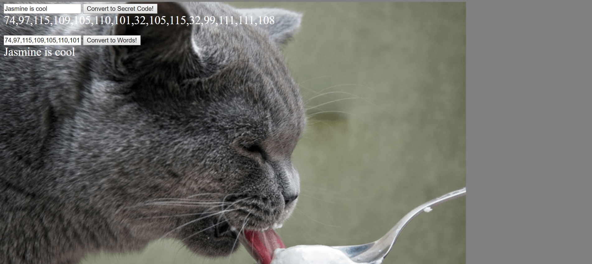

# code-maker-breaker

This was our first pop quiz. We had to use two new functions to code and uncode a string of text. It was a rather difficult challenge.

## How to run this project
* Use npm to install http-server in your terminal:
```sh
npm install -g http-server
```
* Run the server
```sh
hs -p 9999
```
* Open chrome and navigate to:
```
localhost:9999
```

## Screenshots

### Homepage

